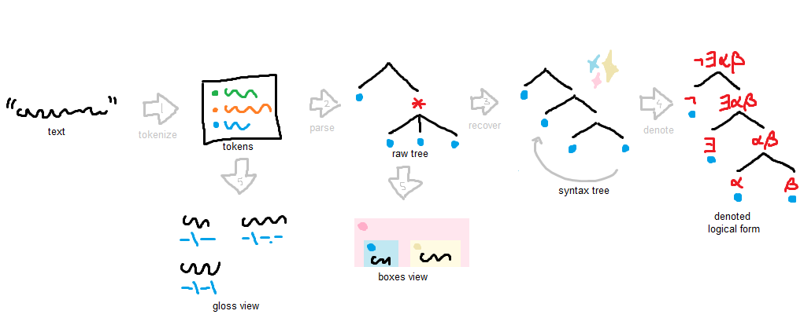

# Kuna

Kuna is a software suite for parsing Toaq Delta. It can translate Toaq into box
diagrams, syntax trees, logic formulas, and more. The word _kuna_ /ˈkʰuːna/ is
Toaq for "sentence."

## Using Kuna

You can play with the web interface [**here**](https://toaq.net/kuna/).

In the _Interactive_ tab, you can write Toaq text, then click any of the buttons
to run Kuna in one of its many modes.

In the _Sentences_ tab, you can explore a corpus of test sentences, and see
which ones are accepted by Kuna. This is a sort of "to-do list" for Kuna
developers.

There is also a _kuna_ bot on the
[Toaq Discord server](https://toaq.me/Discord). Type `/` to see the available
commands. It even has a few minigames!

## Running Kuna locally

You can check out this repository using git (or
[download a zip file from GitHub](https://github.com/toaq/kuna/archive/refs/heads/main.zip))
and run the code on your computer using
[Node.js](https://nodejs.org/en/download/).

For proper PNG rendering, install
[Noto Sans Math](https://fonts.google.com/noto/specimen/Noto+Sans+Math).

To run as a web app (at <http://localhost:5173/>), run these commands in a
terminal:

```sh
npm install
npm run web -- --port 5173
```

To run as a CLI app:

```sh
npm install
npm run cli
# e.g.
npm run cli -- tree-text --sentence "Jaı jí"
```

To run as a Discord bot:

```sh
export KUNA_CLIENT_ID=your.discord.client.id
export KUNA_TOKEN=your.discord.bot.token
npm install
npm run bot
```

## How Kuna works



1. The input text is tokenized by `src/morphology/tokenize.ts`.
2. The token stream is parsed by a context-free grammar for surface-level Toaq,
   defined in `src/toaq.kuna.ne`.
3. A
   [logical form](https://toaqlanguage.wordpress.com/2022/09/26/logical-language-misconceptions/)
   tree is recovered by `src/syntax/recover.ts`. This involves undoing
   [syntactic movement](https://en.wikipedia.org/wiki/Syntactic_movement) and
   adding scope information to the tree.
4. This tree can be interpreted/denoted by the code in `src/semantics` to
   produce a semantic representation (formula).
5. The various modules in `src/modes` can transform, annotate, consume, or
   display these results.

## Useful commands

- `npm run data:build` downloads all English definitions from Toadua and guesses
  glosses and frames, storing the result in `data/toadua/toadua.json`.
  - The result is checked into version control for convenience, but we can run
    this every once in a while to teach Kuna new words.
- `npm run codegen` converts `src/toaq.kuna.ne` to `src/toaq.ne`. This runs
  automatically after `npm install`.
